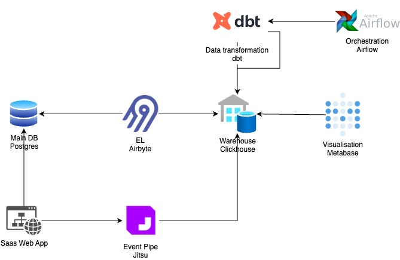
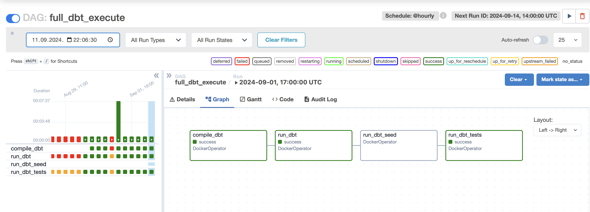
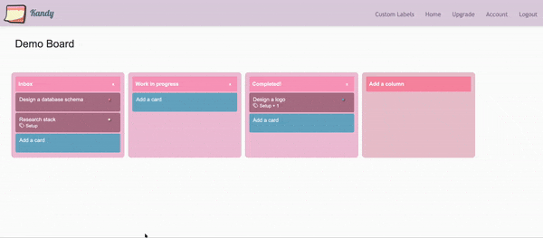

# saas-analytics-solution

### Analytics solution for a demo Kanban board SaaS app - Mint

It consists of open source tools orchestrated together to form a solution for tracking usage analytics for product improvement
and a typical set of KPIs for tracking success and growth of SaaS companies.

### Data sources
- production database data of a demo application
- events emitted from client and server of a demo application

### Solution Architecture

- Warehouse: Clickhouse
- EL (of ETL): Airbyte
- Event tracking: Jitsu
- Visualization: Metabase
- Transformation (of ETL): dbt
- Orchestration: Airflow

[Event Specification](diagrams_and_spec/event_spec.md)

### Orchestration

Airflow DAG

### Dashboards

##### Customers and Revenue

Adjusted from dbt's example https://www.getdbt.com/blog/modeling-subscription-revenue

##### A look at Customer Clustering Results

### Saas App - Kandy

Kanban board demo app

#### Relational database schema

+ more to come
